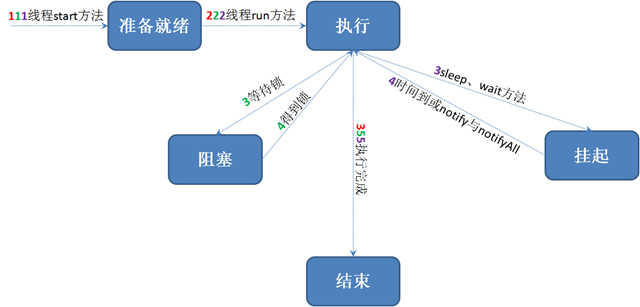
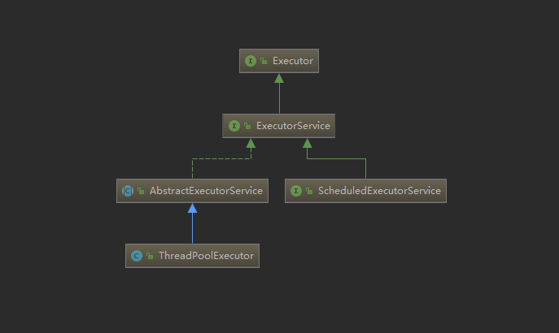
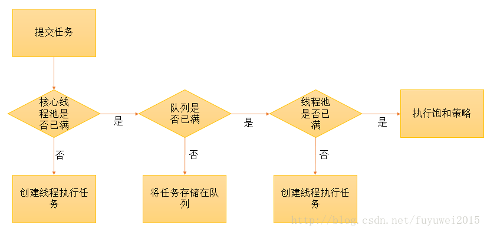

## 引言
线程在 Java 开发中是一个很重要的概念。 在Java中，“线程”指两件不同的事情：
> java.lang.Thread 类的一个实例；
>
> 线程的执行。

<!--more-->

## Java 线程

### 线程和进程

#### 概念

进程是指一个内存中运行的应用程序，每个进程都有自己独立的一块内存空间，即进程空间（虚空间）。进程不依赖于线程而独立存在，一个进程中可以启动多个线程。系统运行一个程序即是一个进程从创建、运行到消亡的过程。

线程是指进程中的一个执行流程，一个进程中可以运行多个线程。线程总是属于某个进程，线程没有自己的虚拟地址空间，与进程内的其他线程一起共享分配给该进程的所有资源。，线程是 CPU 执行的基本单位，是花费最小开销的实体。

#### 区别
进程有独立的内存空间，进程中的数据存放空间（堆空间和栈空间）是独立的，至少有一个线程。

线程中堆空间是共享的，栈空间是独立的，线程消耗的资源比进程小的多。

> 一个进程中的多个线程是并发运行的，从微观角度看存在先后顺序，哪个线程被执行完全取决于 CPU 的调度，程序员无法干涉。这也就造成了多线程的随机性。
>
> Java 程序的进程里面至少包含两个线程，主线程也就是 main() 方法线程，另外一个是垃圾回收机制线程。每当使用 java 命令执行一个类时，实际上都会启动一个 JVM，对应一个进程。
>
> 由于创建一个线程的开销比创建一个进程的开销小的多，在开发多任务运行的时候，通常考虑创建多线程，而不是创建多进程。

实际开发中使用多线程的优势在于

- 进程之间不能共享内存，而线程之间可以共享内存。
- 系统创建进程需要为该进程重新分配系统资源，创建线程的代价则小的多，因此多任务并发时，多线程效率高。
- Java 语言本身内置多线程功能的支持，而不是单纯作为底层系统的调度方式，从而简化了多线程编程。

### 线程的状态
图一




图二


### 分类
Java 中的线程可以分为用户线程（User Thread）和守护线程（Daemon Thread）。

只要当前 JVM 实例中存在任何一个非守护线程没有结束，守护线程就全部工作；当最后一个非守护线程结束，即虚拟机中只存在守护线程时，JVM 就会停止运行。Daemon Thread 的作用是为其他线程提供各种服务，最典型的应用就是垃圾收集器。
```Java
public class Main {

    public static void main(String[] args) {
        Thread thread = new Thread();
        thread.setDaemon(true);
        System.out.println("is daemon thread? " + thread.isDaemon());
    }
}
```
输出为
```
is daemon thread? true
```
使用守护线程要注意的点
- `thread.setDaemon(true)` 必须在 `thread.start()` 之前设置，否则抛出一个 IllegalThreadStateException 异常。因为不能把正在运行的常规线程设置为守护线程。
- 在 Daemon Thread 中产生的新线程也属于 Daemon Thread。 
- 不要在 Daemon Thread 中分配读写操作或者计算逻辑任务。 

### Runnable 和 Thread
Runnable 是一个线程接口，查看其构造
```Java
public interface Runnable {
    public abstract void run();
}
```
其中只定义了一个`run`方法

Thread 是实现了 Runnable 接口的类，所有新建 Thread 实例的方法最后都会调用到内部的`init`
```
private void init(ThreadGroup g, Runnable target, String name,
                      long stackSize, AccessControlContext acc,
                      boolean inheritThreadLocals)
```
观察 Thread 中重写的`run`方法
```Java
@Override
public void run() {
    if (target != null) {
        target.run();
    }
}
```
其中 target 为 Runnable 对象，即调用 Thread 的`run`实际上是调用我们传进去的 Runnable 的对应方法

观察其`start`方法
```Java
public synchronized void start() {
    //不能重复调用 start 方法
    if (threadStatus != 0)
        throw new IllegalThreadStateException();
        
    //将线程加入线程组
    group.add(this);
    //线程开始标志
    boolean started = false;
    try {
        //调用native方法开始多线程
        start0();
        started = true;
    } finally {
        try {
            if (!started) {
                group.threadStartFailed(this);
            }
        } catch (Throwable ignore) {
            /* do nothing. If start0 threw a Throwable then
              it will be passed up the call stack */
        }
    }
}
```
其中`start0`是 native 方法，在其中新建线程，然后回调 target 的 run 方法。

也就是说，如果我们直接调用`run`方法，相当于调用普通方法，不会有多线程效果。只有调用`start`才会在后台开启另一个线程，等待 CPU 调度。

### 多线程 API
#### Object
实际上除了 Thread，Java 的基类 Object 中也定义了一些关于多线程操作的方法

| 方法            | 描述                                                         |
| --------------- | ------------------------------------------------------------ |
| wait()          | 锁对象调用该方法使当前线程进入等待状态，并立刻释放锁对象，直到被其他线程唤醒进入等锁池 |
| wait(long)      | 锁对象调用该方法使当前线程进入等待状态，同时释放锁对象。但是超过等待的时间后线程会自动唤醒，或者被其他线程唤醒，并进入等锁池中。 |
| wait(long, int) | 和o.wait(long)方法一样，如果int参数大于0则前面的long数字加1000 |
| notify()        | 随机唤醒一个处于等待中的线程（同一个等待阻塞池中）           |
| notifyAll()     | 唤醒所有等待中的线程（同一个等待阻塞池中）                   |

以上的方法必须写在 synchronized 方法内部或者 synchronized 块内部，因为它们要求当前正在运行`object.wait()`方法的线程拥有 object 的对象锁，否则抛出异常，测试代码如下
```Java
public class ThreadTest {
    public static void main(String[] args) {
        Thread t = Thread.currentThread();
        try {
            t.wait(2000);   //由于没有获得锁，将抛出 IllegalMonitorStateException 异常
        } catch (InterruptedException e) {
            e.printStackTrace();
        }
        System.out.println("current Thread info in Main: " + t.toString());
        A a = new A();
        a.printThreadInfo();
    }
}

class A {
    public synchronized void printThreadInfo() {
        Thread t = Thread.currentThread();
        try {
            wait(2000);
        } catch (InterruptedException e) {
            e.printStackTrace();
        }
        System.out.println("current Thread info in A: " + t.toString());
    }
}
```
删除`main`中 try/catch 语句之后，控制台输出如下
```
current Thread info in Main: Thread[main,5,main]
//等待两秒
current Thread info in A: Thread[main,5,main]
```
**为什么需要在 synchronized 中？**
> wait和notify用于线程间通信。
> 以生产者消费者模式举例，生产者和消费者通过队列进行通信，对于队列的操作要保证线程安全性
>
> 一般对队列的操作如下:
> while(queue.size() == MAX_SIZE){ wait() }
>
> 假如不对这段代码加锁，就会出现问题。模拟一个生产者线程t1和一个消费者线程t2
>
> - t1判断队列满，需要 wait 阻塞线程。
>
> - 但是就在t1还没有调用 wait 的时候，消费者t2消费了一个产品，导致队列非满。
>
> - 这时候生产者线程t1调用 wait 阻塞，造成的情况就是队列非满，但是生产者线程阻塞了。
>
> - 假如此时消费者不消费了，那么生产者则会一直阻塞下去。
>
> - 所以在调用 wait、notify 以及 notifyAll 等方法时一定要进行同步处理。

**为什么定义在 Object 中？**
> Object 中的`wait()`, `notify()`等方法，和 synchronized 一样，会对“对象的同步锁”进行操作。
>
> `wait()`会使“当前线程”等待。进入等待状态时，线程应该释放它锁持有的“同步锁”，否则其它线程获取不到该“同步锁”将无法运行！
> 当线程释放它持有的“同步锁”之后变成等待线程，可以被`notify()`或`notifyAll()`唤醒。那么，`notify()`依据什么唤醒等待线程的？或者说，`wait()`等待线程和`notify()`之间通过什么关联起来？答案是：依据“对象的同步锁”。
>
> 负责唤醒等待线程的那个线程(“唤醒线程”)，只有在获取“该对象的同步锁”(这里的同步锁必须和等待线程的同步锁是同一个)，并且调用`notify()`或`notifyAll()`方法之后，才能唤醒等待线程。此时因为唤醒线程还持有“该对象的同步锁”，所以必须等到唤醒线程释放了“对象的同步锁”之后，等待线程才能获取到“对象的同步锁”进而继续运行。
>
> 总之，`notify()`, `wait()`依赖于“同步锁”，而“同步锁”是对象锁持有，并且每个对象有且仅有一个！
>
> 这就是`notify()`, `wait()`等函数定义在 Object 类，而不是 Thread 类中的原因。
>
> 来自 [JAVA 线程状态及转化](https://www.cnblogs.com/happy-coder/p/6587092.html)

#### Thread 
| 方法                      | 描述                                                         |
| ------------------------- | ------------------------------------------------------------ |
| Thread.currentThread()    | 返回对当前线程对象的引用                                     |
| Thread.interrupted()      | 检测当前线程是否已经中断（调用该方法后将该线程的中断标志位设为false，连续两次调用该方法第二次肯定为false） |
| Thread.sleep(long millis) | 使当前线程睡眠（不会释放锁对象，可以让其他线程有执行的机会） |
| Thread.yield()            | 使当前线程放弃cpu的执行权（有可能立刻又被重新选中继续执行，只可能给优先级更高的线程机会） |
| t.getId()...              | 返回该线程的 id 等等信息                                     |
| t.interrupt()             | 将该线程中断（实际并不会中断，只是将中断标志设置为true）     |
| t.isInterrupted()         | 检测该线程是否已经中断                                       |
| t.join()                  | 在a线程中调用b.join()，则a线程阻塞，直到b线程执行完          |
| t.join(long millis)       | 同上，不过a线程阻塞的时间根据long的大小有关，如果达到设定的阻塞时间，就算b线程没有执行完，a线程也会被唤醒。 |

---
关于 interrupt，[JAVA interrupt、interrupted和isInterrupted的区别](https://blog.csdn.net/qpc908694753/article/details/61414495)
> interrupt 方法是用于中断线程的，调用该方法的线程的状态将被置为"中断"状态。
>
> 注意：线程中断仅仅是设置线程的中断状态位，不会停止线程。需要用户自己去监视线程的状态并做处理。支持线程中断的方法（也就是线程中断后会抛出 InterruptedException 的方法，比如这里的sleep，以及Object.wait等方法）就是在监视线程的中断状态，一旦线程的中断状态被置为“中断状态”，就会抛出中断异常。

#### 废弃方法
- stop：会释放该线程所持有的所有锁，但这种释放是不可控制、非预期的。而且一个线程不应该由其他线程来强制中断或停止，而应该自行停止
- suspend：线程在暂停的时候仍然占有该资源，导致需要该资源的线程产生环路等待，从而造成死锁。
- resume：用来回复被挂起的线程，跟 suspend 对应。

## 线程池

Java 中关于线程池的继承关系如下



Executor 是一个顶层接口，其中只声明了一个方法`execute(Runnable)`，用来执行传进去的任务

ExecutorService 接口继承了 Executor 接口，并声明了一些方法：`submit`、`invokeAll`、`invokeAny`以及`shutDown` 等

抽象类 AbstractExecutorService 实现了 ExecutorService 接口，基本实现了 ExecutorService 中声明的所有方法

ThreadPoolExecutor 继承了类 AbstractExecutorService，是线程池实现类，构造方法如下
```Java
    public ThreadPoolExecutor(int corePoolSize,
                              int maximumPoolSize,
                              long keepAliveTime,
                              TimeUnit unit,
                              BlockingQueue<Runnable> workQueue,
                              ThreadFactory threadFactory,
                              RejectedExecutionHandler handler) {
        if (corePoolSize < 0 ||
            maximumPoolSize <= 0 ||
            maximumPoolSize < corePoolSize ||
            keepAliveTime < 0)
            throw new IllegalArgumentException();
        if (workQueue == null || threadFactory == null || handler == null)
            throw new NullPointerException();
        this.corePoolSize = corePoolSize;
        this.maximumPoolSize = maximumPoolSize;
        this.workQueue = workQueue;
        this.keepAliveTime = unit.toNanos(keepAliveTime);
        this.threadFactory = threadFactory;
        this.handler = handler;
    }
```

- corePoolSize：核心池的大小，创建了线程池后，默认情况下，线程池中并没有任何线程，而是等待有任务到来才创建线程去执行任务，除非调用`prestartAllCoreThreads`或者`prestartCoreThread`方法预创建线程，即在没有任务到来之前就创建 corePoolSize 个线程或者一个线程。当线程池中的线程数目达到 corePoolSize 后，到达的任务会被放到缓存队列中
- maximumPoolSize：线程池最大线程数，表示在线程池中最多能创建多少个线程
- keepAliveTime：线程没有任务执行时最多保持多久时间会终止。默认情况下，当线程池中的线程数大于 corePoolSize 时，如果一个线程空闲的时间达到 keepAliveTime，就会终止，直到线程池中的线程数不超过 corePoolSize。但如果调用了`allowCoreThreadTimeOut(boolean)`方法，即使线程数不大于 corePoolSize，该参数也会起作用，直到线程池中的线程数为0
- unit：参数keepAliveTime的时间单位，有7种取值
```
TimeUnit.DAYS;               //天
TimeUnit.HOURS;             //小时
TimeUnit.MINUTES;           //分钟
TimeUnit.SECONDS;           //秒
TimeUnit.MILLISECONDS;      //毫秒
TimeUnit.MICROSECONDS;      //微妙
TimeUnit.NANOSECONDS;       //纳秒
```

- workQueue：阻塞队列，用来存储等待执行的任务，会对线程池的运行过程产生重大影响。一般来说有以下几种选择：
```
ArrayBlockingQueue;
LinkedBlockingQueue;
SynchronousQueue;
```
- threadFactory：线程工厂，主要用来创建线程
- handler：表示当拒绝处理任务时的策略，有以下四种选择：
```
ThreadPoolExecutor.AbortPolicy：丢弃任务并抛出 RejectedExecutionException 异常。 
ThreadPoolExecutor.DiscardPolicy：也是丢弃任务，但是不抛出异常。 
ThreadPoolExecutor.DiscardOldestPolicy：丢弃队列最前面的任务，然后重新尝试执行任务（重复此过程）
ThreadPoolExecutor.CallerRunsPolicy：由调用线程处理该任务 
```

#### 为何使用
- 降低资源消耗<br>
  可以重复利用已创建的线程降低线程创建和销毁造成的消耗。 
- 提高响应速度<br> 
  当任务到达时，任务可以不需要等到线程创建就能立即执行。 
- 提高线程的可管理性 <br>
  线程是稀缺资源，如果无限制地创建，不仅会消耗系统资源，还会降低系统的稳定性，使用线程池可以进行统一分配、调优和监控

#### 如何使用
实际上新建线程池都通过工厂类 Executors 类实现，其中定义一些新建 ThreadPoolExecutor 实例的工厂方法
```Java
    //创建可容纳固定数量线程的线程池，每个线程的存活时间是无限的
    //线程池满了就不再添加线程；
    //如果池中的所有线程均在繁忙状态，对于新任务会进入阻塞队列中(无界的阻塞队列)
    public static ExecutorService newFixedThreadPool(int nThreads, ThreadFactory threadFactory) {
        return new ThreadPoolExecutor(nThreads, nThreads,
                                      0L, TimeUnit.MILLISECONDS,
                                      new LinkedBlockingQueue<Runnable>(),
                                      threadFactory);
    }
    
    //有新任务到来，则插入到SynchronousQueue中，由于SynchronousQueue是同步队列
    //因此会在池中寻找可用线程来执行，若有可以线程则执行，若没有可用线程则创建一个线程来执行该任务
    //若池中线程空闲时间超过指定大小，则该线程会被销毁。
    public static ExecutorService newCachedThreadPool(ThreadFactory threadFactory) {
        return new ThreadPoolExecutor(0, Integer.MAX_VALUE,
                                      60L, TimeUnit.SECONDS,
                                      new SynchronousQueue<Runnable>(),
                                      threadFactory);
    }
    
    //创建只有一个线程的线程池，且线程的存活时间是无限的
    //当该线程正繁忙时，对于新任务会进入阻塞队列中(无界的阻塞队列)
    public static ExecutorService newSingleThreadExecutor(ThreadFactory threadFactory) {
        return new FinalizableDelegatedExecutorService
            (new ThreadPoolExecutor(1, 1,
                                    0L, TimeUnit.MILLISECONDS,
                                    new LinkedBlockingQueue<Runnable>(),
                                    threadFactory));
    }
    
    //创建一个固定大小的线程池，线程池内线程存活时间无限制，线程池可以支持定时及周期性任务执行
    //如果所有线程均处于繁忙状态，对于新任务会进入DelayedWorkQueue队列中
    //这是一种按照超时时间排序的队列结构
    public static ScheduledExecutorService newScheduledThreadPool(
            int corePoolSize, ThreadFactory threadFactory) {
        return new ScheduledThreadPoolExecutor(corePoolSize, threadFactory);
    }
```
ThreadPoolExecutor 中比较重要的方法

| 方法          | 描述                                                      |
| ------------- | --------------------------------------------------------- |
| execute()     | 向线程池提交一个任务，交由线程池去执行                    |
| submit()      | 向线程池提交任务的，能够返回任务执行的结果（利用 Future） |
| shutdown()    | 关闭线程池                                                |
| shutdownNow() | 关闭线程池                                                |

还有其他的方法比如：`getQueue()`、`getPoolSize()` 、`getActiveCount()`、`getCompletedTaskCount()`等用来获取线程池的相关属性。

简单使用
```Java
    public static void main(String[] args) {
        ExecutorService executor = Executors.newSingleThreadExecutor();
        System.out.println(Thread.currentThread());
        executor.execute(()-> {
            System.out.println(Thread.currentThread());
        });
    }
```
控制台输出
```
Thread[main,5,main]
Thread[pool-1-thread-1,5,main]
```
#### 工作原理
观察 ThreadPoolExecutor 中的`execute`方法
```Java
public void execute(Runnable command) {
        if (command == null)
            throw new NullPointerException();
  
        /**
         * 一、判断当前活跃线程数是否小于 corePoolSize，如果小于，调用 addWorker 创建线程执行任务
         * 二、如果大于 corePoolSize，将任务添加到 workQueue 队列。
         * 三、如果加入 workQueue 失败，则创建线程执行任务，
         *     如果创建线程失败(当前线程数大于maximumPoolSize)，就会调用reject(内部用handler)处理拒绝任务。
         */
        int c = ctl.get();
        if (workerCountOf(c) < corePoolSize) {
            if (addWorker(command, true))
                return;
            c = ctl.get();
        }
        if (isRunning(c) && workQueue.offer(command)) {
            int recheck = ctl.get();
            if (! isRunning(recheck) && remove(command))
                reject(command);
            else if (workerCountOf(recheck) == 0)
                addWorker(null, false);
        }
        else if (!addWorker(command, false))
            reject(command);
    }
```

跟踪`addWorker`方法
```Java
private boolean addWorker(Runnable firstTask, boolean core) {
    retry:
    for (int c = ctl.get();;) {
        // Check if queue empty only if necessary.
        if (runStateAtLeast(c, SHUTDOWN)
            && (runStateAtLeast(c, STOP)
                || firstTask != null
                || workQueue.isEmpty()))
            return false;
        for (;;) {
            /*
             *在创建非核心线程，即core等于false时。判断当前线程数是否大于等于maximumPoolSize，
             *如果大于等于则返回false，即上边说的第三步中创建线程失败的情况
             */
            if (workerCountOf(c)
                >= ((core ? corePoolSize : maximumPoolSize) & COUNT_MASK))
                return false;
            if (compareAndIncrementWorkerCount(c))
                break retry;
            c = ctl.get();  // Re-read ctl
            if (runStateAtLeast(c, SHUTDOWN))
                continue retry;
            // else CAS failed due to workerCount change; retry inner loop
        }
    }
        
    boolean workerStarted = false;
    boolean workerAdded = false;
    Worker w = null;
    try {
        /*
         * 创建Worker时会调用threadFactory来创建一个线程。
         * 上边的第二步中中启动一个线程会触发Worker的run方法被线程调用。
         */
        w = new Worker(firstTask);
        final Thread t = w.thread;
        if (t != null) {
            final ReentrantLock mainLock = this.mainLock;
            mainLock.lock();
            try {
                int c = ctl.get();
                
                if (isRunning(c) ||
                    (runStateLessThan(c, STOP) && firstTask == null)) {
                    if (t.isAlive()) // precheck that t is startable
                        throw new IllegalThreadStateException();
                    workers.add(w);
                    int s = workers.size();
                    if (s > largestPoolSize)
                        largestPoolSize = s;
                    workerAdded = true;
                }
            } finally {
                mainLock.unlock();
            }
            if (workerAdded) {
                t.start();
                workerStarted = true;
            }
        }
    } finally {
        if (! workerStarted)
            addWorkerFailed(w);
    }
    return workerStarted;
}
```
新建 Work ，同时也会利用工厂类实例化一个线程
```Java
Worker(Runnable firstTask) {
    setState(-1); // inhibit interrupts until runWorker
    this.firstTask = firstTask;
    this.thread = getThreadFactory().newThread(this);
}
```
如果 workerAdded，调用`t.start()`
```Java
public void run() {
    runWorker(this);
}
```
跟踪`runWorker`
```Java
final void runWorker(Worker w) {
    Thread wt = Thread.currentThread();
    Runnable task = w.firstTask;
    w.firstTask = null;
    w.unlock(); // allow interrupts
    boolean completedAbruptly = true;
    try {
        while (task != null || (task = getTask()) != null) {
            if ((runStateAtLeast(ctl.get(), STOP) ||
                 (Thread.interrupted() &&
                  runStateAtLeast(ctl.get(), STOP))) &&
                !wt.isInterrupted())
                wt.interrupt();
            try {
                beforeExecute(wt, task);
                try {
                    task.run();
                    afterExecute(task, null);
                } catch (Throwable ex) {
                    afterExecute(task, ex);
                    throw ex;
                }
            } finally {
                task = null;
                w.completedTasks++;
                w.unlock();
            }
        }
        completedAbruptly = false;
    } finally {
        processWorkerExit(w, completedAbruptly);
    }
}
```
可以看到`getTask`方法不断从 workerQueue 中读取任务然后执行。只要`getTask`方法不返回 null，循环就不会退出。
```Java
private Runnable getTask() {
    boolean timedOut = false; // Did the last poll() time out?
    for (;;) {
        int c = ctl.get();
        if (runStateAtLeast(c, SHUTDOWN)
            && (runStateAtLeast(c, STOP) || workQueue.isEmpty())) {
            decrementWorkerCount();
            return null;
        }
        int wc = workerCountOf(c);

        //是判断当前线程数是否大于 corePoolSize
        boolean timed = allowCoreThreadTimeOut || wc > corePoolSize;

        if ((wc > maximumPoolSize || (timed && timedOut))
            && (wc > 1 || workQueue.isEmpty())) {
            if (compareAndDecrementWorkerCount(c))
                return null;
            continue;
        }
        
        /*
         * 如果当前线程数大于 corePoolSize，调用 workQueue 的poll方法获取任务
         * 超时时间为 keepAliveTime。如果超时，poll返回了null，上边的while循序就会退出
         * 如果当前线程数小于 corePoolSize，调用 workQueue 的take方法阻塞当前
         */
        try {
            Runnable r = timed ?
                workQueue.poll(keepAliveTime, TimeUnit.NANOSECONDS) :
                workQueue.take();
            if (r != null)
                return r;
            timedOut = true;
        } catch (InterruptedException retry) {
            timedOut = false;
        }
    }
}
```
最后用一张图总结上述过程

