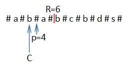
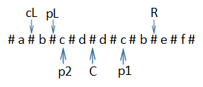
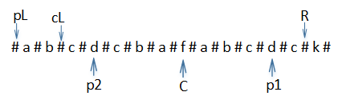
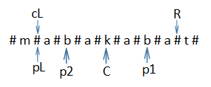

## 题目
给定一个字符串 s，找到 s 中最长的回文子串。你可以假设 s 的最大长度为1000。

```
Input: "babcd"
Output: "bab"
```
<!--more-->

本文将介绍三种解法，重点介绍时间复杂度最低的Manacher算法。

## O(n^3)算法

### 思路
- 从最长的子串开始，遍历所有该原字符串的子串；
- 每找出一个字符串，就判断该字符串是否为回文；
- 子串为回文时，则找到了最长的回文子串，因此结束；反之，继续遍历。

### 时间复杂度
- 遍历字符串子串：嵌套一个循环：O(n^2)；   
- 判断是否为回文：再次嵌套一个循环：O(n^3)。

### 代码

```
public static String longestPalindrome(String s) {
    if(s.length() <= 1)
        return s;
    for(int i = s.length();i > 0; i--) {//子串长度
        for(int j = 0; j <= s.length() - i; j++) {
            String sub = s.substring(j , i + j);//子串位置
            int count = 0;//计数，用来判断是否对称
            for (int k = 0; k < sub.length() / 2; k++) {//左右对称判断
                if (sub.charAt(k) == sub.charAt(sub.length() - k - 1))
                    count++;
            }
            if (count == sub.length() / 2)
                return sub;
        }
    }
    return "";//表示字符串中无回文子串
}
```

## O(n^2)算法

### 思路

- 将子串分为单核和双核的情况，单核即指子串长度为奇数，双核则为偶数；
- 遍历每个除最后一个位置的字符index(字符位置)，单核：初始low = 初始high = index，low和high均不超过原字符串的下限和上限；判断low和high处的字符是否相等，相等则low++、high++（双核：初始high = 初始low+1 = index + 1）；
- 每次low与high处的字符相等时，都将当前最长的回文子串长度与high-low+1比较。后者大时，将最长的回文子串改为low与high之间的；
- 重复执行第二、三步，直至high-low+1 等于原字符串长度或者遍历到最后一个字符，取当前截取到的回文子串，该子串即为最长的回文子串。

### 时间复杂度

- 遍历字符：一层循环——O(n-1)；

- 找以当前字符为中心的最长回文子串：嵌套两个独立循环——O(2n*(n-1)) = O(n^2)


### 代码
```
private static int maxLen = 0;

private static String sub = "";

public static String longestPalindrome(String s) {
    if(s.length() <= 1)
        return s;

    for(int i = 0;i < s.length()-1;i++){
        findLongestPalindrome(s,i,i);//单核回文
        findLongestPalindrome(s,i,i+1);//双核回文
    }
    return sub;
}

public static void findLongestPalindrome(String s,int low,int high) {
    while (low >= 0 && high <= s.length()-1){
        if(s.charAt(low) == s.charAt(high)){
            if(high - low + 1 > maxLen){
                maxLen = high - low + 1;
                sub = s.substring(low , high+1);
            }
            low --;//向两边扩散找当前字符为中心的最大回文子串
            high ++;
        } else
            break;
    }
}
```

## O(n)算法——Manacher算法

最右回文右边界的中心点C，如下图，p=4时，R=6，C=3



#### 具体过程
首先大的方面分为两种情况：

`第一种情况`：下一个要移动的位置在最右回文右边界R的右边。

比如在最开始时，R=-1,p的下一个移动的位置为p=0，p=0在R=-1的右边；p=0时，此时的R=0，p的下一个移动位置为p=1，也在R=0的右边。<br>
在这种情况下，采用普遍的解法，将移动的位置为对称中心，向两边扩，同时更新回文半径数组，最右回文右边界R和最右回文右边界的对称中心C。

`第二种情况`：下一个要移动的位置就是最右回文右边界R或是在R的左边

在这种情况下又分为三种：

1. 下一个要移动的位置p1不在最右回文右边界R右边，且cL<pL。<br>
p2是p1以C为对称中心的对称点；<br>
pL是以p2为对称中心的回文子串的左边界；<br>
cL是以C为对称中心的回文子串的左边界。<br>
这种情况下p1的回文半径就是p2的回文半径radius[p2]。<br>
<br>
2. 下一个要移动的位置票p1不在最右回文右边界R的右边，且cL>pL。<br>
p2是p1以C为对称中心的对称点；<br>
pL是以p2为对称中心的回文子串的左边界；<br>
cL是以C为对称中心的回文子串的左边界；<br>
这种情况下p1的回文半径就是p1到R的距离R-p1+1。<br>
<br>
3. 下一个要移动的位置票p1不在最右回文右边界R的右边，且cL=pL。<br>
p2是p1以C为对称中心的对称点；<br>
pL是以p2为对称中心的回文子串的左边界；<br>
cL是以C为对称中心的回文子串的左边界；<br>
这种情况下p1的回文半径就还要继续往外扩，但是只需要从R之后往外扩就可以了，扩了之后更新R和C。<br>


### 时间复杂度
从上面的分析中，可以看出，第二种情况的1，2的求某个位置的回文半径的时间复杂度是O(1)，对于第一种情况和第二种情况的3，R是不断的向外扩的，不会往回退，而且寻找回文半径时，R之内的位置是不进行判断的，所以对整个字符串而言，R的移动是从字符串的起点移动到终点，时间复杂度是O(n),即整个Manacher的时间复杂度是O(n)。

### 代码
```
public static char[] manacherString(String str){
    StringBuilder sb = new StringBuilder();
    for (int i = 0; i < str.length(); i++) {
        sb.append("#");
        sb.append(str.charAt(i));
    }
    sb.append("#");
    return sb.toString().toCharArray();
}

public static int longestPalindrome(String s) {
    if(s == null || s.length() < 1) {
        return s;
    }
    char[] charArr = manacherString(s);
    int[] radius = new int[charArr.length];
    int R = -1;
    int C = -1;
    int max = Integer.MIN_VALUE;
    for (int i = 0; i < radius.length; i++) {
        radius[i] = R > i ? Math.min(radius[2*C-i],R-i+1):1;
        while(i+radius[i] < charArr.length && i - radius[i] > -1) {
            if(charArr[i-radius[i]] == charArr[i+radius[i]]) {
                radius[i]++;
            } else {
                break;
            }
        }
        if(i + radius[i] > R){
            R = i + radius[i]-1;
            C = i;
        }
        max = Math.max(max,radius[i]);
    } 
    return max;
}

```