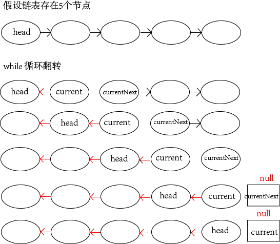

### Problem1：单例模式实现
```Java
public class Singleton {  

    private volatile static Singleton singleton;  
    private Singleton (){}  
    
    public static Singleton getSingleton() {  
        if (singleton == null) {  
            synchronized (Singleton.class) {  
                if (singleton == null) {  
                    singleton = new Singleton();  
                }  
            }  
        }  
        return singleton;  
    }  
} 
```
<!--more-->
### Problem2：二维数组中的查找

在一个二维数组中，每一行都按照从左到右递增的顺序排序，每一列都按照从上到下递增的顺序排序。请完成一个函数，输入这样的一个二维数组和一个整数，判断数组中是否含有该整数。

```java
    /**
     * 从二维数组的右上角开始选取与 key 比较的整数
     * column 的变化:arr[0].length - 1 ---> 0
     * row 的变化 0 ---> arr.length
     *
     * @param arr 
     * @param key 
     */
public static boolean find(int[][] arr, int key) {
    int col = arr[0].length - 1;
    int row = 0;
    while (col >= 0 && row < arr.length) {
        if (arr[row][col] == key) {
            return true;
        } else if (arr[row][col] > key) {   //大于查找值，则往前推一列
            col--;
        } else {    //小于查找值，则往下推一行
            row++;
        }
    }
    return false;
}
```


### Problem3：替换空格

请实现一个函数，将字符串的每个空格替换为"%20"。例如输入`We are happy`，则输出`We%20are%20happy`。

```java
    /**
     * 使用 StringBuilder
     * 
     * @param str
     * @return
     */
    public static String replace(String str) {
        if (str.isEmpty()) {
            return "";
        }
        StringBuilder builder = new StringBuilder();
        for (int i = 0; i < str.length(); i++) {
            if (str.charAt(i) == ' ') {
                builder.append("%20");
            } else {
                builder.append(str.charAt(i));
            }
        }
        return builder.toString();
    }
```


### Problem4：从尾到头打印链表

输入一个链表的头结点，按照从尾到头的顺序打印出每个节点的值

```java
static class ListNode<T> {
    T value;
    ListNode next;

    public ListNode(T value) {
        this.value = value;
    }
}

/**
 * 使用栈实现
 *
 * @param headNode
 */
public static void printListReverse(ListNode headNode) {
    Stack<ListNode> stack = new Stack<>();
    while (headNode != null) {
        stack.push(headNode);
        headNode = headNode.next;
    }
    while (!stack.empty()) {
        System.out.println(stack.pop().value + " ");
    }
}

public static void main(String[] args) {
    ListNode<Integer> node = new ListNode<>(1);
    node.next = new ListNode<>(2);
    node.next.next = new ListNode<>(3);
    printListReverse(node);
}
```


### Problem5：重建二叉树

输入某二叉树的前序遍历和中序遍历结果，请重建出该二叉树。

假设输入的前序遍历和中序遍历的结果中都不包含重复的数字。

例如输入前序遍历序列： `{1, 2, 4, 7, 3, 5, 6, 8}`

中序遍历序列：`{4, 7, 2, 1, 5, 3, 8, 6}`

重建出所示二叉树并且输出它的头结点。

```java
                     1
                   /   \
                  2     3
                 /     / \
                4     5   6
                 \        /
                 7        8
```

#### 知识点补充

> 前序遍历：先访问根节点，再访问左子结点，最后访问右子结点；（根左右）
>
> 中序遍历：先访问左子结点，再访问根结点，最后访问右子结点；（左根右）
>
> 后序遍历：先访问左子结点，再访问右子结点，最后访问根结点；（左右根）

> 二叉搜索树：左子结点总是小于或等于根结点，而右子结点总是大于或等于根结点。
>
> 二叉树的特例是**堆**和**红黑树**。
>
> 堆分为最大堆和最小堆。在最大堆中根节点的值最大，在最小堆中根节点的值最小。
>
> 红黑树是把树中的结点定义为红、黑两种颜色，并通过规则确保从根结点到叶结点的最长路径的长度不超过最短路径的两倍。

### Problem6：用两个栈实现队列
用两个栈实现一个队列。队列的声明如下，请实现它的两个函数
`appendTail`和`deleteHead`,分别完成在队列尾部插入结点和在队列头部删除结点的功能
```Java
public class ConstructQueue {
    /*
     s1 用来实现放入新的元素，直接放到栈顶
     s2 用来辅助删除元素，删除队头时，先将 s1 中除底部元素之外全都移到 s2
     然后删除底部元素，再将 s2 元素移回 s1
     */
    Stack<String> stack1 = new Stack<>();
    Stack<String> stack2 = new Stack<>();

    // 实现appendTail函数
    public void appendTail(String s) {
        stack1.push(s);
    }

    // 实现deleteHead函数
    public String deleteHead() {
        while (!stack1.empty()) {
            stack2.push(stack1.pop());
        }
        String head = stack2.pop();
        while (!stack2.empty()) {
            stack1.push(stack2.pop());
        }
        return head;
    }

    public static void main(String[] args) {
        ConstructQueue queue = new ConstructQueue();
        queue.appendTail("a");
        queue.appendTail("b");
        queue.appendTail("c");
        queue.appendTail("d");
        System.out.println(queue.deleteHead());
        System.out.println(queue.deleteHead());
    }
}
```
输出如下
```
a
b
```
### Problem7：旋转数组的最小数字
把一个数组最开始的若干个元素搬到数组的末尾，我们称之为数组的旋转 。输入一个递增排序的数组的旋转，输出旋转数组的最小元素。
例如数组 `{3, 4, 5, 1, 2}`为`{1, 2, 3, 4, 5}`的一个旋转，该数组的最小值为 1;

```Java
public static void main(String[] args) {
    int[] a = {3, 4, 5, 1, 2};
    System.out.println(minNumInRotateArray(a));
}

/**
     * 注意到旋转之后的数组可以划分为两个排序子数组，前面的子数组元素都大于或等于后面子数组的元素。
     * 还可以注意到最小的元素刚好是这两个子数组的分界点。在排序数组中我们可以用二分查找法实现O(logn)的查找。
     *
     * 用两个指针分别指向数组的第一个元素和最后一个元素。按照旋转规则，第一个元素应该大于等于最后一个元素。
     * 接着可以找到数组中间的元素。如果中间元素位于前面的递增数组，则它应该大于等于第一个指针指向的元素，
     * 此时我们要找到的最小元素肯定应该位于该中间元素的后面。这样我们把第一个指针指向中间元素，从而缩小查找范围。
     * 同理第二个指针的范围也将逐渐缩小
     *
     * 第一个指针总是指向前面的递增数组元素，第二个指针总是指向后面的递增数组元素。
     * 最终第一个指针将指向前面的子数组的最后一个元素，第二个指针将指向后面的子数组的第一个元素，
     * 即二者最后指向相邻的元素，且第二个指针指向的刚好是最小的元素——循环结束条件。
     * 
     * @param array
     */
public static int minNumInRotateArray(int[] array) {
    if (array == null) {
        return 0;
    }
    int left = 0;
    int right = array.length - 1;
    int mid = 0;
    while (array[left] >= array[right]) {
        if (right - left == 1) {
            mid = right;
            break;
        }
        mid = (left + right) / 2;

        // 此时应该用顺序查找，因为不确定array[mid]位于哪个有序子数组
        if (array[left] == array[right] && array[right] == array[mid]) {
            return findInOrder(array, left, right);
        }
        
        if (array[left] <= array[mid]) {
            left = mid;
        } else {
            right = mid;
        }
    }
    return array[mid];
}

static int findInOrder(int[] array, int left, int right) {
    int k = array[left];
    for (int i = 0; i < right; i++) {
        if (array[i] < k) {
            k = array[i];
        }
    }
    return k;
}
```

### Problem8：斐波那契数列
写一个函数，输入n，求斐波那契数列的第n项，斐波那契数列的定义如下： 
> n=0, f(n)=0;
> n=1, f(n)=1; 
> n>1, f(n) = f(n-1) + f(n-2).

```Java
public static void main(String[] args) {
    for (int i = 0; i < 11; i++) {
        System.out.print(fibonacci(i) + " ");
    }
}

public static int fibonacci(int n) {
    if (n == 0) {
        return 0;
    }
    if (n == 1) {
        return 1;
    }
    return fibonacci(n-1) + fibonacci(n-2);
}
```
输出结果
```
0 1 1 2 3 5 8 13 21 34 55 
```
### Problem9：二进制中1的个数
请实现一个函数，输入一个整数，输出该数二进制表示中1的个数。

例如把9表示成二进制是1001，有2位是1，因此如果输入9，该函数输出2。

```
public static int oneCountsOfBinary(int i) {
    char[] chars = Integer.toBinaryString(i).toCharArray();
    int count = 0;
    for (char c : chars) {
        if (c == '1') {
            count++;
        }
    }
    return count;
}

public static int _oneCountsOfBinary(int i) {
    int count = 0;
    int flag = 1;
    while (flag != 0) {
        if ((i & flag) != 0) {
            count++;
        }
        flag = flag << 1;
    }
    return count;
}
```

### Problem10：数值的整数次方
 实现函数`double power(double base, int exponent)`，求 base 的 exponent 次方。不能使用库函数，同时不需要考虑大数问题。 
```Java
public static double power(double base, int exponent) {
    if (base <= 0) {
        throw new RuntimeException("运算无意义");
    }
    if (exponent == 0) {
        return 1;
    }
    if (exponent < 0) {
        return 1 / powerUnsigned(base, -exponent);
    } else {
        return powerUnsigned(base, exponent);
    }
}

static double powerUnsigned(double base, int exponent) {
    double result = base;
    for (int i = 1; i < exponent; i++) {
        result = result * base;
    }
    return result;
}
```

### Problem11：O（1）时间删除链表结点
给定单向链表的头指针和一个结点指针，定义一个函数在O(1)时间删除该结点。
```Java
static class Node {
    int value;
    Node next;

    public Node(int value) {
        this.value = value;
    }
}

/**
 * 只有一个节点时，直接置空
 * 当待删除节点为尾节点时，需要遍历得到上一个节点，然后让得到的节点的next 为 null
 * 否则 p->next 的值赋值给p，把p->next删除掉
 *
 * @param head
 * @param delNode
 */
public static void deleteNode(Node head, Node delNode) {
    if (head == null || delNode == null) {
        return;
    }
    if (head == delNode) {
        head = null;
        return;
    }
    if (delNode.next == null) {
        Node temp = head;
        while (temp.next != delNode) {
            temp = temp.next;
        }
        temp.next = null;
        return;
    }
    delNode.value = delNode.next.value;
    delNode.next = delNode.next.next;
}
```
### Problem12：调整数组中奇数和偶数的先后顺序
输入一个整数数组，实现一个函数来调整该数组中数字的顺序，使得所有 奇数位于数组的前半部分，所有偶数位于数组的后半部分;
```Java
public static void orderArray(int[] array) {
    int left = 0;
    int right = array.length - 1;
    while (left < right) {
        while (left < right && !isEven(array[left])) {
            left ++;
        }
        while (left < right && isEven(array[right])) {
            right --;
        }
        if (left < right) {
            int temp = array[left];
            array[left] = array[right];
            array[right] = temp;
        }
    }
}

static boolean isEven(int i) {
    return ((i & 1) == 0);
}
```

### Problem13：链表中倒数第K个结点
输入一个链表，输出该链表中倒数第K个结点。为了符合大多数人的习 惯，从1开始计数，即链表的尾结点是倒数第一个结点。

例如一个链表有6个结点，从头结点开始它们的值依次是`1、2、3、4、5、6`。这个链表的倒数第三个结点是值为4的结点。

```Java
    /**
     * 使用两个指针解决，第一个指针从链表的头指针开始遍历向前走k-1，第二个指针保持不动
     * 从第k步开始，第二个指针也开始从链表的头指针开始遍历
     * 由于两个指针的距离保持在k-1，当第一个指针到达链表的尾结点时，第二个指针刚好在倒数第k个结点上
     * 
     * @param head 头结点
     * @param k 倒数第k个节点
     */
    public static int find(ListNode head, int k){
        if (head == null) {
            return 0;
        }
        ListNode first = head;
        ListNode second = head;
        for (int i = 1; i < k; i++) {
            if (first.next != null) {
                first = first.next;
            } else {
                return 0;
            }
        }
        System.out.println(first.val);
        while (first.next != null) {
            first = first.next;
            second = second.next;
        }
        System.out.println(first.val);
        return second.val;
    }

    static class ListNode {
        int val;
        ListNode next;

        public ListNode(int val) {
            this.val = val;
        }
    }
```
### Problem14：翻转链表
定义一个函数，输入一个链表的头结点，反转该链表并输出反转后链表的头结点




```Java
    /**
     * 翻转单链表
     * 
     * @param head 原链表的头节点
     * @return 翻转之后的头节点
     */
    public static ListNode getReversedListHead(ListNode head) {
        if (head == null) {
            return null;
        }
        //current节点是head的下一个节点
        ListNode current = head.next;
        //当前的head变为链表的尾，所以next为空
        head.next = null;
        
        while (current != null) {
            //currentNext节点是current的下一个节点。
            ListNode currentNext = current.next;
            //current.next反方向指向以前的节点
            current.next = head;
            
            //移动head和current指针，到后面head重新成为头节点
            head = current;
            current = currentNext;
        }
        return head;
    }

    /**
     * 翻转单链表的递归实现
     *
     * @param head 原链表的头节点
     * @return 翻转之后的头节点
     */
    public static ListNode reverseListByRecursion(ListNode head) {
        if (head == null || head.next == null) {
            return head;
        }
        ListNode newList = reverseListByRecursion(head.next);
        head.next.next = head;
        head.next = null;
        return newList;
    }
```

### Problem15：合并两个排序的链表

输入两个递增排序的链表，合并这两个链表并使新链表中的结点仍然是按照递增排序的。

```java
    public static ListNode merge(ListNode n1, ListNode n2) {
        if (n1 == null) {
            return n2;
        }
        if (n2 == null) {
            return n1;
        }
        ListNode mergeNode = null;
        if (n1.val < n2.val) {
            mergeNode = n1;
            mergeNode.next = merge(n1.next, n2);
        } else {
            mergeNode = n2;
            mergeNode.next = merge(n1, n2.next);
        }
        return mergeNode;
    }
```


### Problem16：树的子结构判断


### Problem17：二叉树的镜像

### Problem18：顺时针打印矩阵

### Problem19：包含min函数的栈

### Problem20：栈的压入、弹出序列

### Problem21：从上往下打印二叉树

### Problem22：二叉搜索树的后序遍历

### Problem23：二叉树中和为某一值的路径

### Problem24：字符串的排列

### Problem25：数组中出现次数超过一半的数字

### Problem26：连续子数组的最大和

### Problem27：整数中1出现的次数

### Problem28：把数组排成最小的数

### Problem29：丑数

### Problem30：第一个只出现一次的字符

### Problem31：数组中的逆序对

### Problem32：两个链表的第一个公共节点

### Problem33：二叉树的深度&&平衡二叉树判断

### Problem34：数字在排序数组中出现的次数

### Problem35：数组中只出现一次的数字

### Problem36：和为S的两个数字 

### Problem37：和为S的连续正数序列

### Problem38：翻转单词的顺序

### Problem39：扑克牌的顺子

### Problem40：y圆圈中最后剩下的数字（约瑟夫环问题）

### Problem41：计算1+2+3+ ··· + n

### Problem42：不用加减乘除做加法

### Problem43：把字符串转换为整数

### Problem44：数组中重复的数字

### Problem45：构建乘积数组

### Problem46：正则表达式匹配

### Problem47：表示数值的字符串

### Problem48：字符流中第一个不重复的字符

### Problem49：链表中环的入口结点

### Problem50：删除链表中欧冠重复的节点

### Problem51：二叉树的下一个节点

### Problem52：把二叉树打印成多行

### Problem53：按之字形顺序打印二叉树

### Problem54：序列化二叉树

### Problem55：二叉搜索树的第K个节点

### Problem56：滑动窗口的最大值大值