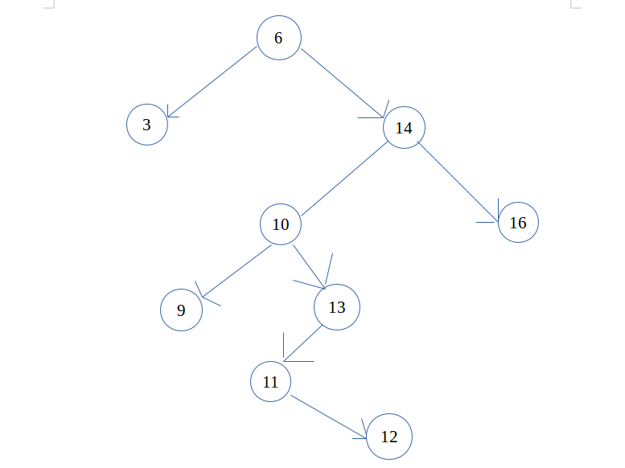
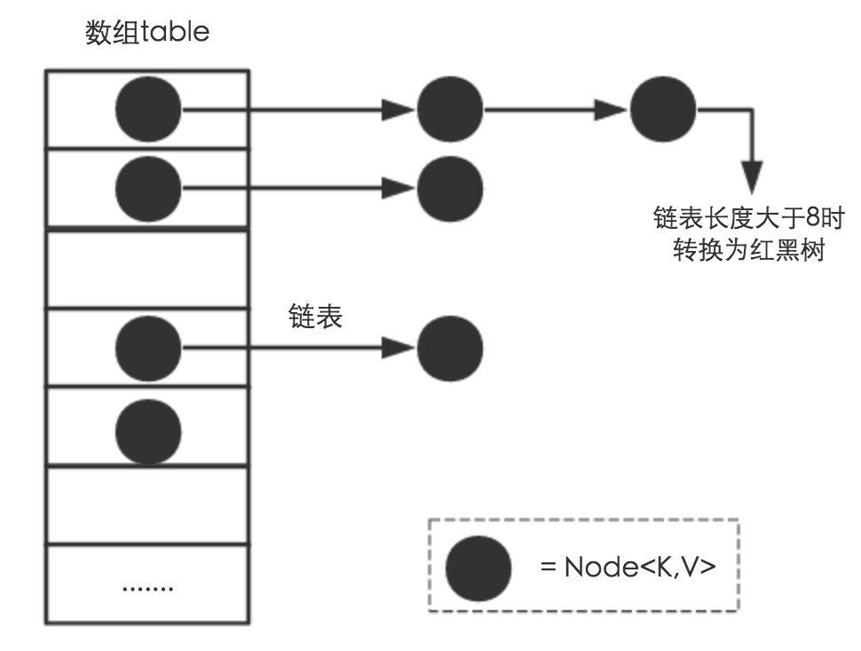

JDK 中提供了很多数据结构，如下所示
> Collection
> ├ List
> │   ├ LinkedList
> │   ├ ArrayList
> │   └ Vector
> │　    └Stack
> └ Set
>
> Map
> ├ Hashtable
> ├ HashMap
> └ WeakHashMap

本文将进行部分数据结构的简单实现。<!--more-->

## Stack
```Java
public class MyStack<T> {

    private Object[] dataArray;
    private int maxSize;
    private int nowSize = 0;

    public MyStack() {
        this(10);
    }

    public MyStack(int initialCapacity) {
        maxSize = initialCapacity;
        dataArray = new Object[maxSize];
    }

    public void push(T data) {
        if (size() >= maxSize) {
            resize();
        }
        dataArray[nowSize++] = data;
    }

    public T pop() {
        if (empty()) {
            return null;
        }
        return (T)dataArray[--nowSize];
    }

    public T peek() {
        if (empty()) {
            return null;
        }
        return (T)dataArray[nowSize-1];
    }

    public int search(T target) {
        int p = nowSize;
        while (p >= 0) {
            if (dataArray[p] == target) {
                return p;
            }
            p--;
        }
        return -1;
    }

    private void resize() {
        maxSize = maxSize << 1;
        Object[] newArray = new Object[maxSize];
        for (int i = 0; i < dataArray.length; i++) {
            newArray[i] = dataArray[i];
        }
        this.dataArray = newArray;
    }

    public int size() {
        return nowSize;
    }

    public boolean empty() {
        return nowSize == 0 ? true : false;
    }
}
```
## Queue
```Java
public class MyQueue<T> {

    private Object[] dataArray;
    private int maxSize;
    private int front;
    private int rear;

    public MyQueue() {
        this(10);
    }

    public MyQueue(int initialSize) {
        maxSize = initialSize;
        dataArray = new Object[maxSize];
        front = rear = 0;
    }

    public void enqueue(T newData) {
        if (size() >= maxSize) {
            resize();
        }
        //非循环队列
        dataArray[rear++] = newData;
        
        //循环队列
        //dataArray[rear] = newData;
        //rear = (rear+1) % maxSize;
    }

    public T dequeue() {
        if (empty()) {
            return null;
        }
        T value = (T)dataArray[front];
        //非循环队列
        dataArray[front++] = null;
        
        //循环队列
        //dataArray[front] = null;
        //front = (front+1) % maxSize;
        
        return value;
    }

    public void resize() {
        maxSize = maxSize << 1;
        Object[] temp = new Object[maxSize];
        for (int i = 0; i < dataArray.length; i++) {
            temp[i] = dataArray[i];
        }
        dataArray = temp;
    }

    public int size() {
        return Math.abs(front - rear);
    }

    public boolean empty() {
        return front == rear ? true : false;
    }
}
```

## BinaryTree



```Java
public class MyBinaryTree<T> {

    private Node root;

    class Node {
        private int key;
        private T value;
        private Node leftChild;
        private Node rightChild;

        public Node(int key, T value) {
            this.key = key;
            this.value = value;
        }
    }

    public Node find(int key) {
        Node currentNode = root;
        while (currentNode != null && currentNode.key != key) {
            if (key < currentNode.leftChild.key) {
                currentNode = currentNode.leftChild;
            } else {
                currentNode = currentNode.rightChild;
            }
        }
        return currentNode;
    }

    public void insert(int key, T value) {
        if (root == null) {
            root = new Node(key, value);
            return;
        }
        Node currentNode = root;
        Node parentNode = root;
        Boolean isLeftChild = true;

        while (currentNode != null) {
            parentNode = currentNode;
            if (key < currentNode.key) {
                currentNode = currentNode.leftChild;
                isLeftChild = true;
            } else {
                currentNode = currentNode.rightChild;
            }
        }
        Node newNode = new Node(key, value);
        if (isLeftChild) {
            parentNode.leftChild = newNode;
        } else {
            parentNode.rightChild = newNode;
        }
    }

    public boolean delete(int key) {
        Node currentNode = root;    //待删除节点
        Node parentNode = root;     //待删除节点的父节点
        Boolean isLeftChild = true;
        while (currentNode != null && currentNode.key != key) {
            parentNode = currentNode;
            if (key < currentNode.key) {
                currentNode = currentNode.leftChild;
                isLeftChild = true;
            } else {
                currentNode = currentNode.rightChild;
                isLeftChild = false;
            }
        }
        if (currentNode == null) {
            return false;
        }
        //删除节点为叶子节点
        if (currentNode.leftChild == null && currentNode.rightChild == null) {
            if (currentNode == root) {
                root = null;
            } else if (isLeftChild) {
                parentNode.leftChild = null;
            } else {
                parentNode.rightChild = null;
            }
        } else if (currentNode.rightChild == null) {    //待删除节点只有左子节点
            if (currentNode == root) {
                root = currentNode.leftChild;
            } else if (isLeftChild) {
                parentNode.leftChild = currentNode.leftChild;
            } else {
                parentNode.rightChild = currentNode.leftChild;
            }
        } else if (currentNode.leftChild == null) {    //待删除节点只有右子节点
            if (currentNode == root) {
                root = currentNode.rightChild;
            } else if (isLeftChild) {
                parentNode.leftChild = currentNode.rightChild;
            } else {
                parentNode.rightChild = currentNode.rightChild;
            }
        } else {    //待删除节点既有左子节点又有右子节点
            Node directPostNode = getDirectPostNode(currentNode);
            currentNode.key = directPostNode.key;
            currentNode.value = directPostNode.value;
        }
        return true;
    }

    /**
     * 获得待删除节点的直接后继节点
     *
     * 当待删除节点既有左孩子，又有右孩子时，例如删除图一中 key 值为 10 的节点
     * 这时就需要用 key 值为 10 的节点的中序后继节点（节点 11）来代替 key 值为 10 的节点
     * 并删除 key 值为 10 的节点的中序后继节点，
     * 由中序遍历相关规则可知， key 值为 10 的节点的直接中序后继节点一定是其右子树中 key 值最小的节点，
     * 所以此中序后继节点一定不含子节点或者只含有一个右孩子
     *
     * 首先找到 key 值为 10 的节点的直接中序后继节点（即其右子树中值最小的节点 11），
     * 并删除此直接中序后继节点，然后将此后继节点的 key、value 值赋给待删除节点的 key，value值
     *
     * @param delNode 待删除节点
     * @return 返回直接后继节点
     */
    private Node getDirectPostNode(Node delNode) {
        Node parentNode = delNode;  //保存待删除节点的直接后继节点的父节点
        Node direcrPostNode = delNode;  //保存待删除节点的直接后继节点
        Node currentNode = delNode.rightChild;

        while (currentNode != null) {
            parentNode = direcrPostNode;
            direcrPostNode = currentNode;
            currentNode = currentNode.leftChild;
        }
        if (direcrPostNode != delNode.rightChild) { //从树中删除此直接后继节点
            parentNode.leftChild = direcrPostNode.rightChild;
            direcrPostNode.rightChild = null;
        }
        return direcrPostNode;

    }

    public void preOrder(Node rootNode) {
        if (rootNode != null) {
            System.out.println(rootNode.key + ": " + rootNode.value);
            preOrder(rootNode.leftChild);
            preOrder(rootNode.rightChild);
        }
    }

    public void inOrder(Node rootNode) {
        if (rootNode != null) {
            preOrder(rootNode.leftChild);
            System.out.println(rootNode.key + ": " + rootNode.value);
            preOrder(rootNode.rightChild);
        }
    }

    public void postOrder(Node rootNode) {
        if (rootNode != null) {
            preOrder(rootNode.leftChild);
            preOrder(rootNode.rightChild);
            System.out.println(rootNode.key + ": " + rootNode.value);
        }
    }
}

```
## HashMap

