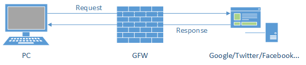

## 前言
GFW是中国互联网上独特而不可忽视的存在，很多人在生活中都主动地搭建翻墙工具或者使用翻墙服务，以此访问“不存在的网站”。本文将记录`GFW`所为何物，以及`翻`的原理。<!--more-->
## GFW

### 所为何物
GFW：Great Firewall (of the People's Republic of China)，中国国家防火墙，由于谐音the Great Wall，所以也称长城防火墙，是中国政府在其互联网边界的审查系统（包括相关行政审查系统），具体指监控和过滤互联网内容的软硬件系统，由服务器和路由器等设备、相关的应用程序构成。 

形象的描述，在没有 GFW 的时代，访问互联网的方式如下

GFW 出现之后，则变成

其内部构造如下

它变成了本地浏览器和网站服务器之间的一道墙，阻拦了访问特定网站的请求，实际上，GFW 的拦截方式是多样的。

GFW的具体原理可以查看此文章：[全面学习GFW](https://cokebar.info/archives/253)

### 如何工作
#### 关键字过滤阻断
关键字过滤系统能够从出口网关收集分析信息，过滤、嗅探指定的关键字。主要针对 HTTP 的默认端口：80端口，因为 HTTP 传播的内容是明文的内容，没有经过加密，而 GFW 是一个 IDS(Intrusion detection system)。普通的关键词如果出现在 HTTP 请求报文的头部(如“Host: www.youtube.com”)时，则会马上伪装成对方向连接两端的计算机发送 RST 包(reset)干扰两者正常的 TCP 连接，进而使请求的内容无法继续查看。 如果GFW在数据流中发现了特殊的内文关键词时，其也会试图打断当前的连接，从而出现用户的网页开启一部分后，突然停止的情况。

#### IP地址封锁
路由器的正常工作方式是：遇到符合已知的IP转发规则的数据包，则按已经规则发送，遇到未知规则IP的数据，则转发到上一级网关。  
GFW 通过路由器，在通往国外的最后一个网关上加上一条伪造的路由规则，导致通往被屏蔽网站的IP数据包无法到达。此外，GFW 对于某些网站会采取独立IP封锁技术，如果该网站使用了由虚拟主机服务提供商提供的多域名、单(同)IP的主机托管服务，就会造成所有该服务提供商的其它使用相同IP地址服务器的网站用户遭殃，就算这些网站的内容可能并无不当之处，也不能在中国大陆正常访问。

#### DNS污染、劫持
DNS 污染是指 GFW 刻意制造出特定的域名服务器分组，把域名指往不正确的IP地址。对于含有多个IP地址或经常变更IP地址逃避封锁的域名，GFW通常会使用此方法进行封锁。2002年被封锁期间，Google的域名就被劫持到百度上。  

DNS劫持和污染的方式有两种： 

- 一种是通过网络服务提供商(Internet Service Provider)提供的 DNS 服务器进 DNS 欺骗，当访问某个网站时，需要要把域名转换为一个IP地址，DNS 服务器负责将域名转换为IP地址，中国大陆的 ISP 接受通信管理局的屏蔽网站的指令后在 DNS 服务器里加入某些特定域名的虚假记录，当使用此 DNS 服务器的网络用户访问此特定网站时，DNS 服务便给出虚假的IP地址，导致访问网站失败，甚至返回 ISP 运营商提供的出错页面和广告页面。 
- 另一种是 GFW 在 DNS 查询使用的 UDP 的53端口上根据blacklist进行过滤，遇到通往国外的使用UDP 53端口进行查询的 DNS 请求，就返回一个虚假的IP地址。

值得一提的是，IPv4时代，全球一共有13组根域名服务器，中国大陆早期有F、I两个根域 DNS 镜像，但因为多次 DNS 污染国外网络，被断开与国际互联网的连接，相关事件查看维基百科：[中国防火长城-污染攻击大事记](https://zh.wikipedia.org/wiki/%E5%9F%9F%E5%90%8D%E6%9C%8D%E5%8A%A1%E5%99%A8%E7%BC%93%E5%AD%98%E6%B1%A1%E6%9F%93#污染攻击大事记)。 

**除了以上几种封锁方法，GFW还会采用SSL连接阻断、特定端口封锁等工作方式。**

## 翻越记

### 翻

#### 修改Hosts文件
足够简单的方式，以解决 GFW 的 DNS 污染和劫持的问题。Hosts 文件是一个储存计算机网络中各节点信息的文件，负责将主机名映射到相应的IP地址，通常用于补充或取代网络中DNS的功能。和DNS不同的是，用户可以直接对 Hosts 文件进行控制。

Hosts 文件的原本目的是提高解析的效率。在进行 DNS 请求以前，系统先检查自己的 Hosts 文件中是否有地址映射关系，如果有则调用该IP地址映射，如果没有再向已知的 DNS 服务器提出域名解析。由于 Hosts 的请求级别比DNS高，当 Hosts 文件里面有对应的IP时，客户端就会直接访问那个IP，而不必通过 DNS。各操作系统的 Hosts 文件各有不同，网络上有很多相关资料，在此不赘述。

所以，将 Google、Twitter、Facebook 之类的IP放入 Hosts 文件，就可以不受 GFW 的 DNS  污染干扰。但由于 GFW 的IP封锁，大多数情况下，该方法很难有效。

#### SSH Tunnel
SSH（Secure Shell）是一个提供数据通信安全、远程登录、远程指令执行等功能的安全网络协议。搭建一个 SSH 隧道翻墙，只需要有一台支持 SSH 的墙外服务器，且该服务器能 SSH 连接即可。 

1. 首先用户和境外服务器基于 SSH 建立起一条加密的通道 (1)
2. 用户通过建立起的隧道进行代理，通过 SSH  Server 向真实的服务发起请求 (2-3)
3. 服务通过 SSH Server，再通过创建好的隧道返回给用户 (4-5)

由于 SSH 本身基于 RSA 加密技术，所以 GFW 无法从数据传输的过程中的加密数据内容进行关键词分析，避免了被重置链接的问题，但由于创建隧道和数据传输的过程中，SSH 本身的特征很明显，所以 GFW 一度通过分析连接的特征进行干扰，导致 SSH 存在被定向进行干扰的问题。

#### VPN
对于企业来说，为了共享资源、协同工作，需要连接各地的分支机构，传统的专线联网方式价格昂贵，一般中小企业难以负担。这时低成本的VPN技术孕育而生。VPN（Virtual Private Network）即虚拟专用网络，利用廉价接入的公共网络（主要使用Inter-net）来传输私有数据，具有成本优势，因此被很多企业和电信运营商采用。

VPN 比Shadowsocks更加底层，它通过操作系统的接口直接虚拟出一张网卡，后续整个操作系统的网络通讯都将通过这张虚拟的网卡进行收发——网络代理的实现思路大都如此。

VPN 的特点如下：
- VPN 的设置是全局的，即所有联网程序都自动使用VPN；但SSH隧道需要程序设定，才会使用隧道联网。
- 商用的VPN一般都是付费的，而自主搭建VPN 的难度要大于SSH隧道，因为SSH隧道只要一台可以SSH的服务器即可，不需要在服务器上配置任何东西。
- VPN 在IP层工作，而Shadowsocks在 TCP/UDP 层工作。

#### Shadowsocks
VPN之类的技术，有一个致命的缺陷：它们虽然通过了无法破解的RSA加密算法来对数据进行加密，但是在交换密钥、建立起隧道前仍在进行明文传输，GFW正是利用这一点，在交换秘钥的过程中暴力破解，这意味着接下来的加密没有任何意义。Shadowsocks所做的一点，就是提前规定好加密方式，解决 GFW 通过分析流量特征进行干扰的问题。

技术原理上，Shadowsocks 是将原来 SSH 创建的 Socks5 协议拆开成 Server 端和 Client 端，其工作过程如下

- 1)、6) 客户端发出的请求基于 Socks5 协议跟 SS Local 端进行通讯，由于这个 SS Local 一般是本机或路由器或局域网的其他机器，不经过 GFW，解决了被 GFW 通过特征分析进行干扰的问题
- 2)、5) SS Local 和 SS Server 两端通过多种可选的加密方法进行通讯，经过 GFW 的时候是常规的TCP包，没有明显的特征码而且 GFW 也无法对通讯数据进行解密
- 3)、4) SS Server 将收到的加密数据进行解密，还原原来的请求，再发送到用户需要访问的服务，获取响应原路返回。

相比传统的 VPN (IKE, IPSec, PPTP…)，Shadowsocks 协议具有更好的灵活性和隐蔽性，且搭建相对简单，可以拥有相对传统VPN更快的速度和更高的稳定性；而对比 V2Ray 这种科学上网的集合体，Shadowsocks在服务端更加轻量，单一协议完善程度更高；同时，Shadowsocks在移动端有更丰富的客户端选择，兼容性和灵活性更优。

##### Shadowsocks-R
虽说Shadowsocks“抹除了流量特征”，但从另一个角度看，其实它的特征也很明显：TCP/UDP上层的包全是密文，几乎和VPN没有区别。为解决这一问题，出现了Shadowsocks-R，它的其中一个特性，是在原 Shadowsocks 协议的数据流前面加上HTTP头，让GFW误认为是HTTP协议，从而对数据流应用针对HTTP的规则。

作为SS的一个发展分支，由于SSR的作者一开始未将其开源（违反了 GPL 协议），所以实际上两者早期有不可调和的分歧。SSR拥有更多的功能，支持更多的加密方式，此外SSR还可以利用运营商的漏洞，开启免流服务，不过这是另一个问题了。

##### V2Ray
V2Ray 的实现原理跟Shadowsocks一脉相承，其特点在于引入新的通信协议，改正 Shadowsocks已有的缺点，使流量特征更难被 GFW 检测到；同时使用 UDP 作为下层协议，避免 TCP 带来的窗口和 RTO(Retry Timeout)等导致网速变慢的问题。

### 记

- 1998年，公安部开展”金盾工程”建设。次年，方滨兴调任国家计算机网络与信息安全管理中心副总工程师。
- 2002年，Google经历多次封锁与解封，主要手段为DNS劫持、TCP会话阻断等。
- 2004年，维基百科遭遇网络封锁，至今未解封。
- 2008年，北京奥运会期间，中国政府短暂放宽GFW的封锁范围。
- 2010年，Google因内容审查问题与中国政府交涉无效后，退出中国。
- 2013年，GFW利用域名污染和关键词过滤等手段屏蔽GitHub，几天后被解封。
- 2015年，Shadowsocks作者 @clowwindy遭遇公安机关调查，随后删除代码，不再参与开发。
- 2017年，Shadowsocks-R作者 @BreakWa11被人肉和人身威胁，随后删除所有项目代码。

## 结语
从二十年前“金盾工程”至今，中国的互联网管制未曾松动，在可预见的未来，应该也不会有所放缓。GFW经过十几年的发展，已经足够成熟，同时对于翻墙这一行为，执政党的治理侧重点也有从技术手段转向行政手段的趋势，每年，个人因为翻墙或者出售翻墙服务而被逮捕的时间屡屡见诸报端。

翻墙技术和GFW每天都在上演道高一尺魔高一丈的戏码，两者的斗争更进一步，可能是人工智能在GFW上的深度部署，或者IPv6的全面普及。

本文的绝大多数资料和图片均来自互联网，避免累赘，不再添加引用说明。